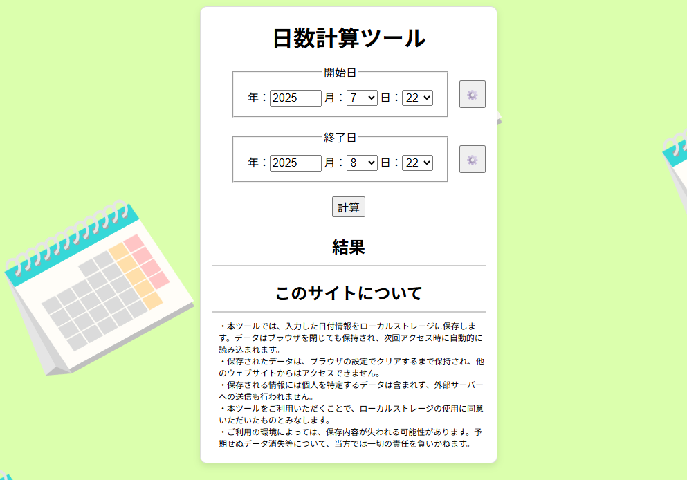

# 日数計算ツール

## 概要

開始日と終了日を指定して、両日間の日数・週数・月数差を計算できるウェブアプリケーションです。
入力した日付情報はブラウザのローカルストレージに保存され、次回アクセス時にも再利用できます。



## 主な機能

- 開始日と終了日を指定して日数・週数・月数を自動計算
- 今日の日付をワンクリックで設定可能
- 入力した日付情報をローカルストレージに保存・呼び出し
- 入力値のバリデーション（西暦 1900 年以降の半角数字のみ受け付け）
- レスポンシブ対応（モバイル表示対応）

## ディレクトリ構成

```
date-calculation/
├── front-end/                    # Reactアプリケーション
│   ├── src/
│   │   ├── components/           # UIコンポーネント
│   │   │   ├── DateField/        # 日付入力フィールド
│   │   │   ├── SettingsMenu/     # 設定メニュー（保存/呼出）
│   │   │   ├── ResultSection/    # 計算結果表示
│   │   │   ├── InfoSection/      # サイト説明
│   │   │   └── Toast/            # 通知表示
│   │   ├── contexts/             # React Context
│   │   │   └── ToastContext.tsx  # トースト通知管理
│   │   ├── hooks/                # カスタムフック
│   │   │   └── useLocalStorage.ts
│   │   ├── types/                # 型定義
│   │   │   └── date.ts
│   │   ├── utils/                # ユーティリティ関数
│   │   │   ├── dateCalculation.ts
│   │   │   └── dateValidation.ts
│   │   ├── App.tsx               # メインコンポーネント
│   │   └── main.tsx              # エントリポイント
│   ├── dist/                     # ビルド成果物
│   └── package.json
├── docs/                         # ドキュメント
│   ├── react-migration-guide.md  # React移行ガイド
│   └── cdk-deploy-plan.md        # AWSデプロイ計画
├── img/                          # 画像
└── README.md
```

## 技術スタック

| カテゴリ       | 技術                     |
| -------------- | ------------------------ |
| フレームワーク | React 19                 |
| 言語           | TypeScript               |
| ビルドツール   | Vite                     |
| スタイリング   | CSS Modules              |
| テスト         | Vitest                   |
| 状態管理       | React Context + useState |

## 工夫した点

### コンポーネント設計

- **単一責任の原則**: 各コンポーネントは 1 つの役割に集中
- **再利用性**: DateField は開始日・終了日で共通利用
- **CSS Modules**: スタイルのスコープを限定し、命名衝突を防止

### 日付計算ロジック

- **純粋関数**: 計算ロジックを utils に分離し、テスト容易性を確保
- **月末考慮**: 1/31 → 2/28 のような月末計算を正確に処理
- **ヘルパー関数**: `getLastDayOfMonth`, `isEndOfMonth`, `addMonths` で可読性向上

### UX 改善

- **コンテキストメニュー**: 歯車ボタンで保存/呼出メニューを表示
- **オーバーレイ方式**: メニュー外クリックで自然に閉じる
- **トースト通知**: 保存/呼出の結果をフィードバック

### データ永続化

- **LocalStorage**: 既存データとの互換性を維持（キー名: `startDay`, `endDay`）
- **カスタムフック**: `useLocalStorage`でロジックを抽象化

## 開発環境のセットアップ

```bash
# リポジトリをクローン
git clone https://github.com/jyoloyG4465/date-calculation.git
cd date-calculation/front-end

# 依存関係をインストール
npm install

# 開発サーバーを起動
npm run dev
```

## 利用可能なスクリプト

| コマンド           | 説明                         |
| ------------------ | ---------------------------- |
| `npm run dev`      | 開発サーバー起動             |
| `npm run build`    | 本番ビルド                   |
| `npm run preview`  | ビルド結果のプレビュー       |
| `npm run test`     | テスト実行（ウォッチモード） |
| `npm run test:run` | テスト実行（1 回のみ）       |
| `npm run lint`     | ESLint によるコードチェック  |

## テスト

```bash
cd front-end
npm run test:run
```

18 件のテストケースで以下をカバー:

- 日数・週数・月数の計算
- 月またぎ・年またぎの計算
- うるう年の計算
- 月末の計算
- バリデーション

## 今後の予定

- AWS CDK によるインフラ構築（S3 + CloudFront）
- カスタムドメイン対応（Route53 + ACM）

詳細は [docs/cdk-deploy-plan.md](./docs/cdk-deploy-plan.md) を参照

## データの保存について

- 入力した日付は、ブラウザのローカルストレージに保存されます
- 保存されたデータは他のウェブサイトからは読み込めません
- ローカルストレージは、ブラウザの設定や手動で削除しない限り保持され続けます

## 注意事項

- 入力できる年は「西暦 1900 年以降の半角数字」のみです
- 間違った日付形式を入力した場合、正しく計算されません
